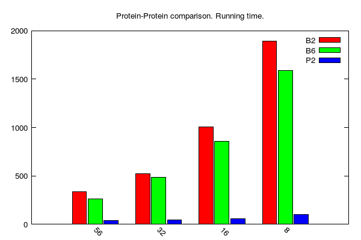
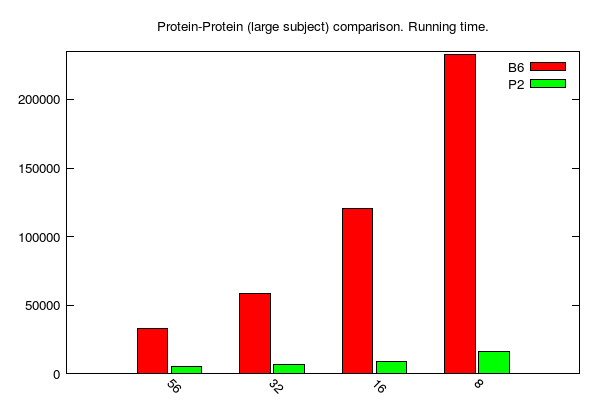
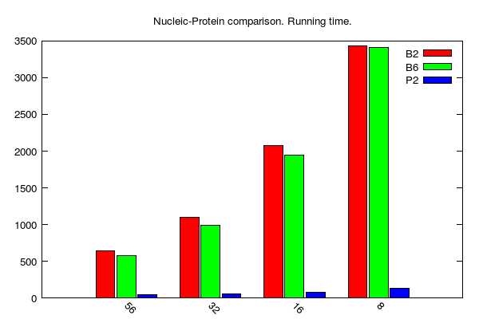
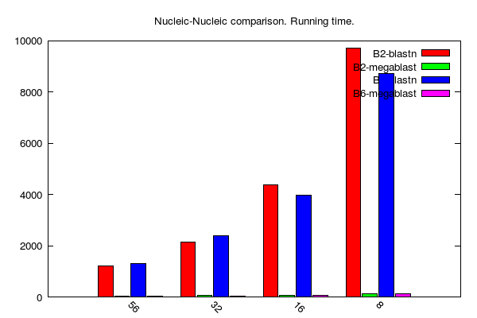

## Benchmarks of BLAST and PLAST

This project provides a script framework originally used to run benchmarks of [BLAST](https://blast.ncbi.nlm.nih.gov/Blast.cgi?CMD=Web&PAGE_TYPE=BlastDocs) and [PLAST](https://plast.inria.fr) on a cluster infrastructure.

Provided scripts were originally designed to run comparison softwares on [IFREMER](http://wwz.ifremer.fr/en/The-Institute)'s [DATARMOR](https://www.top500.org/system/178981) computer providing the PBS job scheduler system. However, it would be easy to adapt theses scripts with any other kind of job schedulers.

## Benchmarks basics

The basic principle of this benchmark was quite easy: find an optimal way to configure NCBI [BLAST](https://blast.ncbi.nlm.nih.gov/Blast.cgi?CMD=Web&PAGE_TYPE=BlastDocs) and INRIA [PLAST](https://plast.inria.fr) sequence comparison tools in order to run them as efficiently as possible on a cluster computer. Tests were conducted by running bank-to-bank sequence comparisons of reasonnable sizes.

## Requirements

Our scripts were designed to work with:

* PBS pro 14.2.4
* NCBI [BLAST](https://blast.ncbi.nlm.nih.gov/Blast.cgi?CMD=Web&PAGE_TYPE=BlastDocs) 2.2.31 and 2.6.0
* INRIA [PLAST](https://plast.inria.fr) 2.3.2

In addition, you need some data sets to run sequence comparisons:

* FASTA files containing BLAST/PLAST queries
* BLAST databanks to be used as subjects for BLAST/PLAST comparison jobs

It is up to you to install all that material.

## Test case on IFREMER's DATARMOR supercomputer

### Presentation

We used [these scripts](scripts) to evaluate the optimal configuration (cores, RAM and walltime) to run sequence comparison jobs (using either BLAST or PLAST) on the [DATARMOR](https://www.top500.org/system/178981) supercomputer available at IFREMER for bioinformatics computational intensive works.

### Jobs configuration

For that purpose, we ran jobs using the following constraints:

* use 8, 16, 32 or 56 cores; DATARMOR provides several hundreds 56-core computing nodes;
* use 32 or 100Go RAM per computing node;
* queries: bacterium *Yersinia pestis* protein sequences (blastp and blastx) or gene sequences (blastn and megablast), i.e. 3979 sequences;
* subject banks: one of Swissprot (555,594 sequences), Genbank Bacteria division (1,604,589 sequences) or TrEmbl (90,050,708 sequences); banks content as available on September 2017.
* softwares: BLAST 2.2.31 & 2.6.0 and PLAST 2.3.2.
* BLAST cmd-line specific parameters: -max_target_seqs 1 -evalue 1e-3 -outfmt 9 (you can review the full BLAST cmd-line [here](scripts/blast_template.txt); see end of script)
* PLAST cmd-line specific parameters: -max-hit-per-query 1 -max-hsp-per-hit 1 -e 1e-3 -outfmt 1 -seeds-use-ratio 0.01 (you can review the full PLAST cmd-line [here](scripts/plast_template.txt); see end of script)

Below, we use the following identifiers to target each kind of queries:

* P: bacterium *Yersinia pestis* protein sequences
* N: bacterium *Yersinia pestis* gene sequences

Same for subject banks:

* P: SwissProt
* PL: TrEmbl
* N: Genbank Bacteria division (to be used to run blastn)
* M: Genbank Bacteria division (to be used to run megablast)

Using these query and subject naming codes, we introduce the following jobs names:

* **P-P**: a protein-protein comparison of bacterium *Yersinia pestis* protein sequences against SwissProt
* **P-PL**: a protein-protein comparison of bacterium *Yersinia pestis* protein sequences against TrEmbl
* **N-N**: a nucleotide-nucleotide (regular BLASTn) comparison of bacterium *Yersinia pestis* gene sequences against Genbank Bacteria division
* **M-N**: a nucleotide-nucleotide (**M** egablast) comparison of bacterium *Yersinia pestis* gene sequences against Genbank Bacteria division
* **N-P**: a nucleotide-protein comparison of bacterium *Yersinia pestis* gene sequences against SwissProt
* **N-PL**: a nucleotide-protein comparison of bacterium *Yersinia pestis* gene sequences against TrEMBL

### Results: running time

Raw results (running times, CPU & memory use on 8, 16 ,32  and 56 cores) are as follows:

* [BLAST 2.2.31](results/results-blast-2.2.31.tsv)
* [BLAST 2.6.0](results/results-blast-2.6.0.tsv)
* [PLAST 2.3.2](results/results-plast-2.3.2.tsv)

Note: content of the above files is described [here](results/README.md)

Since we were interested in running times, here are some graphical outputs (generated using material from sub-folder [gnuplot](gnuplot)):

* y-axis: running time (seconds)
* x-axis: number of cores
* B2, B6 and P stands for BLAST 2.2.31, BLAST 2.6.0 and PLAST 2.3.2, respectively

* **BLASTp/PLASTp medium jobs** ([data table is here](gnuplot/pp-time.dat)): 
* **BLASTp/PLASTp large jobs** ([data table is here](gnuplot/ppl-time.dat)): 
* **BLASTx/PLASTx jobs** ([data table is here](gnuplot/np-time.dat)): 
* **BLASTn jobs** ([data table is here](gnuplot/nn-time.dat)): 
* **Megablast jobs** ([data table is here](gnuplot/mn-time.dat)): 

Note: N-N and M-N comparisons not done using PLAST since it is not optimal with regards to BLAST performance.

### Results: Impact of RAM available on computing nodes

Here, we were interested to check whether or not BLAST running times change given the amount of RAM available on a computing node. We used two configurations: 32Gb vs. 100Gb (all other search parameters were the same over the various jobs).

* 

    * y-axis: log scale of running time (i.e. walltime); unit is seconds.
    * x-axis: type of comparison; e.g. "P-P-56" = protein-protein comparison on 56 cores.
    * data table [is here](gnuplot/mem-time.dat)

## Same test cases using HTC-BLAST

In this section, we describe the use of [HTC-BLAST 4.3](http://citeseerx.ist.psu.edu/viewdoc/download?doi=10.1.1.194.2320&rep=rep1&type=pdf) framework to dispatch BLAST jobs.

For these tests, we dispatched BLAST jobs on one up to five 28-core nodes on  [DATARMOR](https://www.top500.org/system/178981)'s machine.

We used the same data sets (i.e. query and subject banks) as for BLAST/PLAST tests, above presented.

On the following plots:

* y-axis: running time (i.e. walltime); unit is seconds
* x-axis: number of cores (28: one 28-core computing node; 56: two 28-core computing nodes; 84: three 28-core computing nodes; and so on...)

* **HTC-BLASTp jobs** ([data table is here](gnuplot/htc-pp-time.dat)): 
* **HTC-BLASTx jobs** ([data table is here](gnuplot/htc-np-time.dat)): 
* **HTC-BLASTn jobs** ([data table is here](gnuplot/htc-nn-time.dat)): 
* **HTC-Megablast jobs** ([data table is here](gnuplot/htc-mn-time.dat)): 

Since we used the same data sets as above, we can appreciate (or not) the advantages of HTC-BLAST over regular BLAST to accelerate (or not) sequence comparisons. In the following table, we compare job running times (i.e. "walltime") of HTC vs Regular BLAST on 56 cores:

| Job kind | Regular BLAST | HTC-BLAST |
|----------|---------------|-----------|
| P-P      |    338 s      |    251 s  |
| N-P      |    647 s      |    517 s  |
| N-N      |   1226 s      |   1985 s  |
| M-N      |     49 s      |    286 s  |
